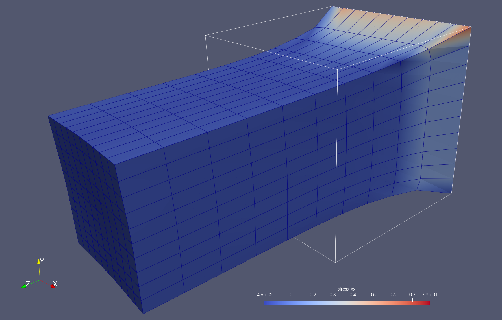

# Welcome to grk

`grk` is a command-line interface (CLI) tool designed to interact with the Grok LLM API. It allows users to push cfold files to Grok LLM and save the output in both cfold and JSON formats.

## Key Features

- **Profile-based Configuration**: Manage multiple configurations for different use cases with a `.grkrc` file.
- **Flexible Input/Output**: Process input files and save responses as JSON and text.
- **Role-based System Messages**: Choose predefined roles for Grok (e.g., Python programmer, lawyer) to tailor responses.
- **Terminal Visualization**: Enhanced user experience with rich terminal output for better readability.

## Design considerations
- **No magic**: Control what gets sent to the LLM by explicitly *folding* the files into a single text file, avoid background reading of git histories etc. 
- **Enable legal applications**: For use with legal documents, it is important that e.g. only pseudonymized versions of documents get submitted. 

## Quick start (a simple 3D finite element solver in python) 
```shell
# write project brief
echo "write a 3d finite element solver using hex8 elements, use it to model a cube with 10x10x10 elements where x,y,z span range [0,1], clamp z==0 and apply unit distributed surface stress in positive z direction at z==1, output a vtu file where stresses and displacements are added as point data to the mesh, use numpy operations for speed and a logger to print progress to stdout, use user [{name="test",email="test@example.com"}]" > README.md

# fold the project
cf 

# start session
gu codefold.json

# ask to implement
gm "please implement according to README" -o __temp.json

# unfold and install
cu __temp.json ; uv pip install -e . 

# close session
gd
```





## Getting Started

- [Installation](./installation.md)
- [Usage Guide](./usage.md)
- [Configuration](./configuration.md)


